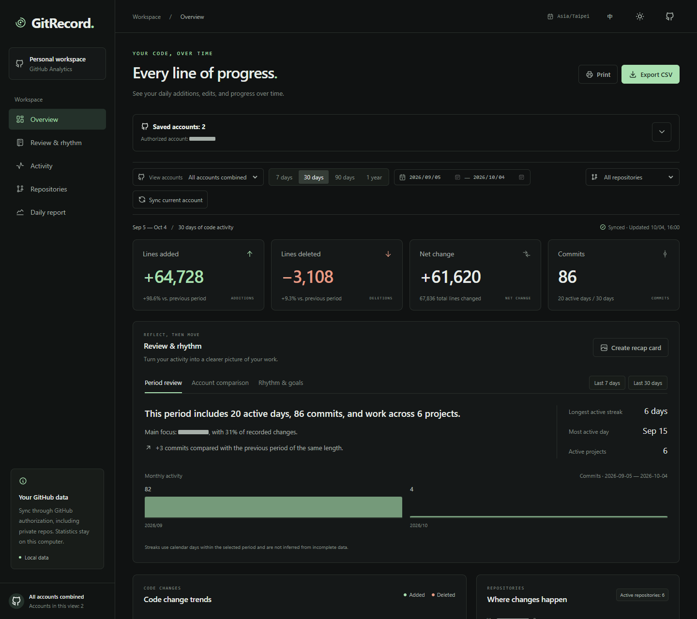
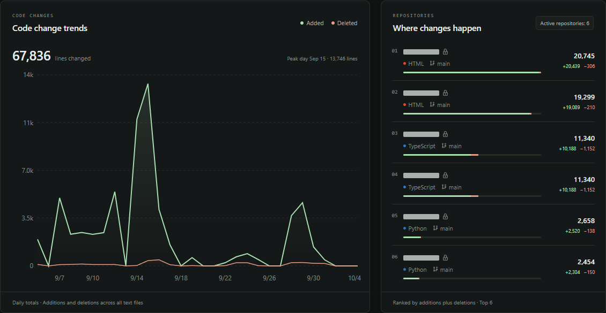
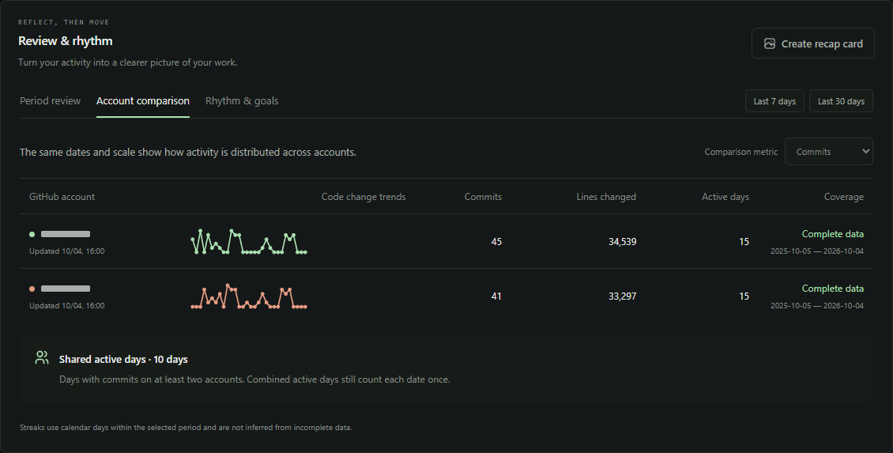
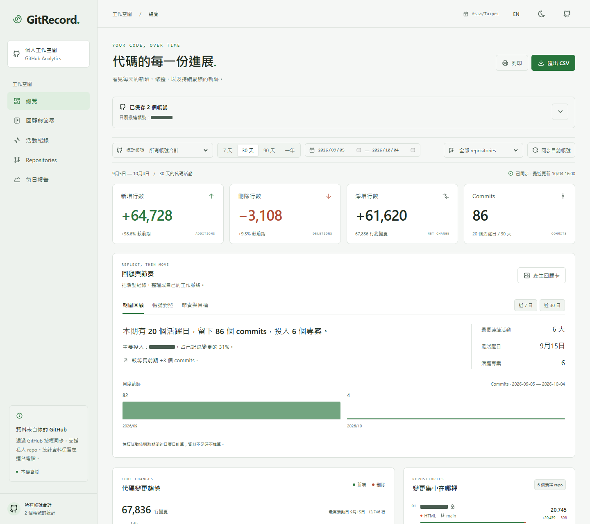
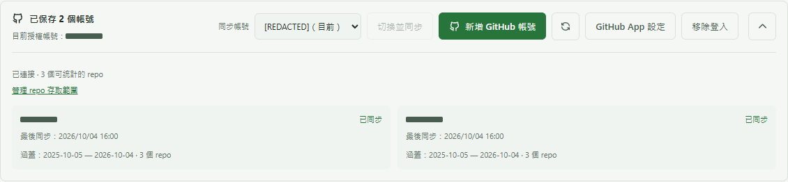
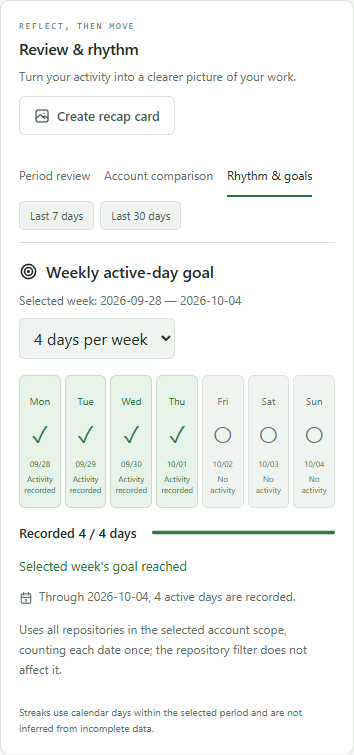

# GitRecord

**Your code, over time.** A local dashboard for GitHub commit activity, multi-account reviews, and privacy-aware exports.

**English** · [繁體中文](README.zh-TW.md)

[](LICENSE)
[](https://nodejs.org/)
[](https://github.com/danieltsai0423/gitrecord/actions/workflows/validate.yml)

GitRecord turns saved GitHub commit statistics into daily trends, repository breakdowns, and period reviews. Connect personal accounts through GitHub, synchronize them one at a time, and view their activity together. Reports stay on your computer.

**No GitHub CLI installation, manually entered token, or custom GitHub App is needed for normal use.**



*Screenshots use synthetic demo data. Every account and project name is masked before capture, including public repository names.*

## Contents

- [Features](#features)
- [Quick start](#quick-start)
- [Connect and manage accounts](#connect-and-manage-accounts)
- [Review your work](#review-your-work)
- [Screenshots](#screenshots)
- [How statistics are calculated](#how-statistics-are-calculated)
- [Privacy and security](#privacy-and-security)
- [Configuration](#configuration)
- [Troubleshooting](#troubleshooting)
- [Development](#development)
- [Contributing and license](#contributing-and-license)

## Features

| Capability | What it provides |
| --- | --- |
| Multi-account analytics | Combined or individual reports, independent account caches, and per-account sync times |
| Activity dashboard | Additions, deletions, net changes, commits, trends, an annual heatmap, and daily details |
| Flexible filters | Last 7, 30, 90, or 365 days, custom dates, account selection, and repository selection |
| Period review | Main projects, monthly activity, longest active streak, and comparison with an equal-length previous period |
| Account comparison | The same dates and chart scale, plus shared active days across accounts |
| Weekly goals | User-defined active-day goals, with each calendar date counted once across accounts |
| Exports | Daily CSV, printable reports, and locally generated PNG or Markdown recap cards |
| Accessible interface | English / Traditional Chinese, light / dark themes, responsive layouts, keyboard controls, and reduced-motion support |
| Honest coverage | Missing dates, partial syncs, and saved sync failures are shown explicitly |

## Quick start

### Requirements

- **Node.js 22.12 or newer**, with npm.
- A modern browser and a GitHub account.
- An internet connection for installing dependencies, authorizing accounts, and synchronizing GitHub data.
- **Windows 11 is the currently validated platform.** macOS and Linux have not yet been verified; credential persistence depends on the operating system's keyring.
- Git if you want to clone the repository. You can instead [download the source ZIP](https://github.com/danieltsai0423/gitrecord/archive/refs/heads/main.zip).

Run these commands in **Windows PowerShell**:

```powershell
git clone https://github.com/danieltsai0423/gitrecord.git
Set-Location .\gitrecord
npm.cmd ci
npm.cmd run build
npm.cmd start
```

If you downloaded the ZIP, open PowerShell in the extracted project folder and start from `npm.cmd ci`.

Open **[http://127.0.0.1:4317](http://127.0.0.1:4317)**, select **Connect GitHub account**, and follow the authorization steps below. The first successful connection synchronizes the most recent 365 days. Existing saved reports can be viewed immediately; use **Sync current account** to update them.

If port 4317 is occupied:

```powershell
npm.cmd start -- --port 4320
```

Then open [http://127.0.0.1:4320](http://127.0.0.1:4320). Keep one application process per project directory to avoid concurrent cache writes.

## Connect and manage accounts

The repository is preconfigured with the public [GitRecord by Daniel](https://github.com/apps/gitrecord-by-daniel) GitHub App. Ordinary users do not need to register an App, configure a callback URL, or create a client secret.

1. Select **Connect GitHub account** or **Add GitHub account** in the dashboard.
2. Copy the one-time authorization code and open GitHub. Sign in to the intended account, enter the code, and authorize the App. Password entry and two-factor authentication happen on GitHub.
3. On first use for that account, select **Choose repos on GitHub**, install the App on your **personal account**, and choose the repositories to include.
4. Return to GitRecord. It checks installation access and starts synchronization once access is ready. If waiting has stopped, use **Recheck**.
5. Repeat once for each additional account. For accounts already connected, choose the account and select **Switch & sync**.

GitHub authorization and App installation are separate steps. Each account needs its own initial authorization and installation. Later switching normally reuses saved credentials; expired or revoked authorization may require reconnecting.

**The account filter changes the report you view. The authorized account determines which account is synchronized.** Filtering reports does not switch the account used for synchronization.

- Use **Manage repository access** to change the selected repositories, then synchronize again.
- Use the account panel's expand / collapse button to keep account controls out of the way; your browser remembers the choice.
- **Remove connection** removes that account's local credential while preserving saved statistics.
- GitHub-side access can be revoked through [Authorized GitHub Apps](https://github.com/settings/apps/authorizations) or [Installed GitHub Apps](https://github.com/settings/installations).

## Review your work

The **Review & rhythm** workspace follows the global account and date filters. Period review and account comparison also follow the repository filter.

### Period review

See recorded active days, commits, main projects, the most active day, monthly distribution, and the longest streak within the selected period. Comparisons use the immediately preceding period of the same length and appear only when both periods have complete data. Monthly bars include only dates inside the selected range.

### Account comparison

Compare accounts over the same dates with a shared chart scale. Choose commits or lines changed. **Shared active days** means dates with commits on at least two accounts; combined active days still count each date once. Desktop uses a table, and mobile uses account cards.

### Rhythm and goals

Set your own weekly goal of 1–7 active days; no goal is assumed initially. Weeks run Monday through Sunday, with the selected report end date as the cutoff. Days after the cutoff are marked **Outside cutoff**.

Goals use **all repositories in the selected account scope**, independently of the repository filter. Settings are saved in the browser by stable GitHub user ID or combined-account scope. If browser storage is unavailable, a goal can still be used for that session.

A zero-line commit still counts as activity. Missing data is not treated as a rest day, and incomplete data does not produce a confirmed streak. These are activity indicators, not productivity rankings.

### Recap cards and reports

Select **Create recap card** to preview a PNG or Markdown summary of the selected period, including monthly activity, main projects, and each account's sync time and coverage. The snapshot is fixed when the preview opens.

- Account names and private project names are hidden by default. Public repositories retain their project name without the owner prefix. You can explicitly turn masking off.
- Images and text are generated locally and are not uploaded to a sharing service.
- **CSV and printable reports include account and repository names.** Review them before sharing. You can save a printable report as PDF through your browser's print dialog.

Recaps use the dates available in the saved report, including a 365-day review; they cannot reconstruct history outside the saved window.

## Screenshots

<details>
<summary>Activity trends, account comparison, light theme, and mobile goals</summary>

### Activity trends and repository breakdown



### Multi-account comparison



### Light theme and Traditional Chinese



### Account management



### Mobile weekly goals



</details>

All documentation images are reproducible through [`scripts/capture-docs.mjs`](scripts/capture-docs.mjs). It uses synthetic data, replaces names with opaque masks, and never reads your local report or credentials.

## How statistics are calculated

| Rule | Definition |
| --- | --- |
| Repositories | Readable, personally owned, non-fork repositories selected in that account's GitHub App installation; both public and private are supported |
| Branch | Each repository's default branch, with its HEAD commit fixed at the start of that repository's query |
| Author | Commits associated with the connected GitHub user ID; no email-based identity inference |
| Commits | Non-merge commits, including root commits; deduplicated by commit ID within each repository |
| Date | `committedDate`, grouped in **Asia/Taipei (UTC+8)**; this timezone is currently fixed |
| Window | Sync day plus the preceding 364 days, ending at the synchronization cutoff |
| Additions / deletions | GitHub's commit-level `additions` and `deletions` |
| Net / changed lines | Additions minus deletions / additions plus deletions |
| Active day | At least one qualifying commit, even if it changes zero lines |
| Combined totals | Counts summed across accounts and repositories; active dates are deduplicated |
| Previous period | Immediately preceding range of equal length, only when both ranges are complete |

**Scope limits:** organization-owned repositories, forks, merge commits, other authors, and work not merged into the default branch are excluded. Commits in separate repositories are counted separately, even if their histories were copied. This is not a replica of GitHub's contribution graph.

Line counts include documentation, generated files, and lockfiles; binary contents have no comparable textual line count. Squashing, rebasing, rewritten history, repository access changes, or author association changes can change subsequent totals. Activity volume does not measure code quality or productivity.

GitHub field definitions are documented in its [Commit schema](https://docs.github.com/en/graphql/reference/commits#commit). Synchronization is subject to [GitHub API rate limits](https://docs.github.com/en/graphql/overview/rate-limits-and-query-limits-for-the-graphql-api).

### Coverage and freshness

Each account retains its own report date range, sync time, and failure status. Resynchronizing replaces that account's report and preserves the others; it does not append duplicate statistics.

The combined window ends on the latest saved report's end date and is capped at 365 days. An account that does not cover selected dates is marked incomplete. A missing date does not establish zero activity. A repository failure marks that account's report partial, and the failed repository's old counts are not mixed into the new report. A global failure preserves the last saved report and shows the error.

The coverage warning provides **GitHub access settings** and **Recheck** for each affected account. Rechecking validates that account's authorization and installation, then synchronizes when ready; report filters remain independent.

## Privacy and security

GitRecord is a **single-user application running on your own computer**. Its Node service listens on `127.0.0.1`, validates local Host headers, rejects cross-origin API requests, and prevents embedding in external frames. It is not a public multi-user hosting service; hosting one requires separate authentication, tenant isolation, and data-storage design.

| Data | Where it goes |
| --- | --- |
| Account / repository metadata and daily statistics | Local `.cache/report.json`; private project names can be present, and this report is not encrypted |
| Access / refresh tokens | OS credential store, through `@napi-rs/keyring`; Windows uses Credential Manager |
| Credential-store fallback | Process memory only, with a UI notice; reconnecting is required after restart |
| Public App configuration and current account selection | Local `.cache/oauth.json`, plus the distributed `oauth.config.json` defaults |
| Language, theme, collapsed panel, and weekly goals | Browser local storage |
| PNG / Markdown / CSV / print exports | Generated locally; saved or copied only when you request an export |

The GitHub App requests **Contents: read** and **Metadata: read**. GitHub's Contents permission can technically read source files, but GitRecord's implemented queries retrieve repository metadata and commit statistics, not source contents, patches, commit messages, or author emails. Repository access is checked on every sync and restricted to the connected personal account's installation.

Tokens are exchanged and refreshed by the local service. They are not returned to the dashboard, put in URLs, written into reports, or saved as plaintext configuration files. App ID, Client ID, and App URL are public identifiers, not credentials. GitRecord has no application telemetry or analytics endpoint; it still connects to GitHub for authorization and synchronization.

Cache files, credentials, environment files, screenshots of real reports, build output, and test artifacts are excluded from Git. Do not commit your `.cache/` directory or share it unintentionally. See [SECURITY.md](SECURITY.md) for private vulnerability reporting.

## Configuration

### Normal users

The default public App is already configured. You only need to authorize an account and choose repositories. There is no client secret, private key, or redirect callback to enter in GitRecord.

### Maintainers and forks using their own App

1. [Register a GitHub App](https://github.com/settings/apps/new) with a unique name and enable **Device Flow** and **Expire user access tokens**.
2. Disable webhooks and leave **Request user authorization (OAuth) during installation** unchecked. GitRecord authorizes through device flow before checking installation access; it does not consume a callback or setup URL.
3. Set **Contents: Read-only**. Metadata is read-only automatically. Do not request other repository, organization, or account permissions or subscribe to events.
4. Choose **Any account** if other people should be able to install it.
5. In the dashboard's **GitHub App settings**, enter the App ID, Client ID, and public `https://github.com/apps/<slug>` URL. GitRecord validates their consistency and permissions before saving them.
6. For distribution, update `oauth.config.json` with your public identifiers. Do not add secrets or private keys.

The distributed defaults are:

```json
{
  "clientId": "Iv23lii6E7ARszfJ36kg",
  "appId": "5185425",
  "appSlug": "gitrecord-by-daniel"
}
```

Configuration precedence is: the complete environment variable group `GITRECORD_GITHUB_CLIENT_ID`, `GITRECORD_GITHUB_APP_ID`, and `GITRECORD_GITHUB_APP_SLUG`; local `.cache/oauth.json`; then distributed `oauth.config.json`. App settings are resolved as a group, without mixing identifiers from different Apps. Switching Apps changes the credential namespace while retaining saved reports.

See GitHub's official [App registration](https://docs.github.com/en/apps/creating-github-apps/registering-a-github-app/registering-a-github-app), [device flow](https://docs.github.com/en/apps/creating-github-apps/authenticating-with-a-github-app/generating-a-user-access-token-for-a-github-app#using-the-device-flow-to-generate-a-user-access-token), and [token refresh](https://docs.github.com/en/apps/creating-github-apps/authenticating-with-a-github-app/refreshing-user-access-tokens) documentation.

### Optional command-line sync

After authorizing in the dashboard, you can synchronize with saved GitRecord credentials:

```powershell
npm.cmd run sync
```

This command calls GitHub directly; it does not run `gh`. Persistent credential storage must be available, and no other process should be writing the same cache. Most users can use the dashboard's sync button instead.

## Troubleshooting

| Symptom | What to check |
| --- | --- |
| A repository is missing | Check App installation selection, then sync. Organization repositories and forks are excluded; other branches or unassociated authors are not counted. |
| Authorization succeeded but sync is blocked | Complete App installation for that same personal account and choose at least one eligible repository. Return and select Recheck. |
| Some accounts do not cover selected dates | Use the warning's account-specific access-settings link and Recheck, or choose a period covered by all accounts. Reauthorizing alone does not update a saved report. |
| Credentials disappear after restart | Check the credential-storage notice. If the OS store is unavailable, tokens only last for the process and the account needs reconnecting. |
| A sync failed or reached an API limit | Read the dashboard error, allow GitHub's limit to reset when applicable, and retry. The previous successful report is preserved. |
| The port is in use | Start with another port, such as `--port 4320`, and open the corresponding loopback URL. |
| PowerShell blocks an npm script | Use the documented `npm.cmd` commands rather than the PowerShell `npm.ps1` wrapper. |
| Upgrading from the original CLI / OAuth App version | Reauthorize and install the current GitHub App once per account. Saved report formats are migrated automatically; old tool credentials are not imported. |

## Development

The stack is React, TypeScript, Vite, Recharts, Tabler Icons, Express, and direct GitHub REST / GraphQL calls.

```powershell
# API + Vite development server: http://127.0.0.1:5173
npm.cmd run dev

# Core statistics, authentication, API, and synchronization tests
npm.cmd test

# Type checks and production build
npm.cmd run build

# Desktop / mobile browser tests (Microsoft Edge)
npm.cmd run test:e2e

# All checks
npm.cmd run validate

# Regenerate masked demo screenshots after building
npm.cmd run docs:screenshots
```

Local E2E tests require Microsoft Edge. Tests use mock GitHub responses and synthetic reports rather than your accounts. Windows credential tests use a separate temporary service name and remove their test entries.

The last local verification on **2026-10-04** passed **48 core / API tests**, the production build, and **56 desktop / mobile E2E tests**. Automated validation runs on Windows through [GitHub Actions](https://github.com/danieltsai0423/gitrecord/actions/workflows/validate.yml).

```text
src/                     Dashboard, themes, translations, and UI components
shared/report.ts         Report types, dates, aggregation, filters, and CSV
shared/reflection.ts     Reviews, account comparisons, weekly rhythm, and masking
src/recap.ts             Local PNG / Markdown recap generation
server/auth.ts           Account connections and synchronization identity
server/oauth.ts          Device authorization and token refresh
server/installation.ts   App validation and repository access boundaries
server/credentials.ts    OS credential storage and public configuration
server/github.ts         Fixed-HEAD, paginated GitHub statistics queries
server/app.ts            Local API, sync locking, and report persistence
scripts/                 Development, optional sync, and documentation capture
tests/                   Core / API and browser tests
specs/                   Original and subsequent feature specifications
docs/images/             Masked screenshots generated from synthetic data
```

## Contributing and license

Bug reports and feature proposals are welcome through [GitHub Issues](https://github.com/danieltsai0423/gitrecord/issues). Please include a reproducible example without tokens, private repository names, or report caches. Read [CONTRIBUTING.md](CONTRIBUTING.md) before submitting a pull request, and use [private security reporting](SECURITY.md) for vulnerabilities.

GitRecord is available under the **[MIT License](LICENSE)**. Third-party components retain their own licenses; see [THIRD_PARTY_NOTICES.md](THIRD_PARTY_NOTICES.md).
