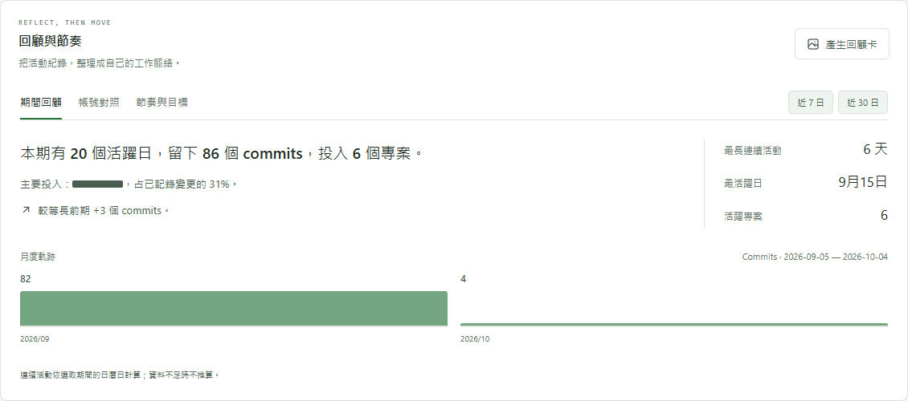

<h1 align="center">GitRecord</h1>

<p align="center">
  <strong>代碼的每一份進展。</strong><br>
  在本機查看 GitHub commit 活動、整合多帳號回顧，並產生可遮名的分享報告。
</p>

<p align="center">
  <a href="README.md"></a>
  <a href="README.zh-TW.md"></a>
</p>

<p align="center">
  <a href="LICENSE"></a>
  <a href="https://nodejs.org/"></a>
  <a href="https://github.com/danieltsai0423/gitrecord/actions/workflows/validate.yml"></a>
</p>

GitRecord 將保存的 GitHub commit 統計整理為每日趨勢、repository 分布與期間回顧。各個人帳號透過 GitHub 授權、依序同步，既能合併查看，也能分別分析；報告保存在自己的電腦。

**一般使用者不必安裝 GitHub CLI、手動輸入 token，或建立自己的 GitHub App。**


*所有截圖都使用範例資料；包含公開 repository 在內的帳號與專案名稱，均在截圖前以不透明遮罩取代。*

## 目錄

- [功能](#功能)
- [快速開始](#快速開始)
- [連接與管理帳號](#連接與管理帳號)
- [回顧自己的工作](#回顧自己的工作)
- [介面截圖](#介面截圖)
- [統計規則](#統計規則)
- [隱私與安全](#隱私與安全)
- [設定](#設定)
- [常見問題與排錯](#常見問題與排錯)
- [開發與驗證](#開發與驗證)
- [參與貢獻與授權](#參與貢獻與授權)

## 功能

| 功能 | 說明 |
| --- | --- |
| 多帳號統計 | 所有帳號合計或單帳號報告；各帳號獨立保存資料與同步時間 |
| 活動 Dashboard | 新增、刪除、淨增行數、commits、趨勢圖、全年熱圖與每日明細 |
| 日期與範圍篩選 | 近 7、30、90、365 日、自訂日期、帳號與 repository 篩選 |
| 期間回顧 | 主要專案、月度活動、最長連續紀錄及等長前期比較 |
| 帳號對照 | 相同日期與圖表尺度，呈現各帳號活動及共同活躍日 |
| 每週目標 | 自訂活躍天數，跨帳號同一天只計一次 |
| 匯出 | 每日 CSV、列印報告，以及本機產生的 PNG／Markdown 回顧卡 |
| 介面與操作 | 繁體中文／英文、深色／淺色、桌面／手機、鍵盤操作與減少動態支援 |
| 資料涵蓋提示 | 未涵蓋日期、部分同步及保存的同步失敗都有明確狀態 |

## 快速開始

### 環境需求

- **Node.js 22.12 以上**，包含 npm。
- 現代瀏覽器與 GitHub 帳號。
- 安裝套件、授權及同步時需要網路連線。
- **目前已驗證的平台為 Windows 11。** macOS／Linux 尚未驗證；憑證能否持久保存取決於作業系統的 keyring。
- 要用 clone 取得原始碼則需要 Git；也可直接[下載 ZIP](https://github.com/danieltsai0423/gitrecord/archive/refs/heads/main.zip)。

在 **Windows PowerShell** 執行：

```powershell
git clone https://github.com/danieltsai0423/gitrecord.git
Set-Location .\gitrecord
npm.cmd ci
npm.cmd run build
npm.cmd start
```

若下載 ZIP，先解壓縮，再於專案資料夾開啟 PowerShell，從 `npm.cmd ci` 開始執行。

開啟 **[http://127.0.0.1:4317](http://127.0.0.1:4317)**，按 **「連接 GitHub 帳號」**，依下節完成授權與安裝。首次成功連接會同步近 365 日；已有快取時直接顯示保存的報告，按「同步目前帳號」更新。

預設埠被占用時：

```powershell
npm.cmd start -- --port 4320
```

改開啟 [http://127.0.0.1:4320](http://127.0.0.1:4320)。同一專案資料夾請只啟動一個程式，避免多個程序同時寫入快取。

## 連接與管理帳號

本專案已預設使用公開的 [GitRecord by Daniel](https://github.com/apps/gitrecord-by-daniel) GitHub App。一般使用者不必註冊 App、設定 callback URL，或建立 client secret。

1. 在 Dashboard 按「連接 GitHub 帳號」或「新增 GitHub 帳號」。
2. 複製一次性授權碼並開啟 GitHub，登入要連接的帳號、輸入授權碼並確認授權。密碼與雙重驗證只在 GitHub 進行。
3. 該帳號第一次使用時，按「前往 GitHub 選擇 repos」，將 App 安裝到自己的**個人帳號**，選擇要統計的 repositories。
4. 回到 GitRecord，程式確認安裝存取就緒後自動同步。若等候已停止，可按「重新檢查」。
5. 其他帳號各完成一次。已連接的帳號選好後，按「切換並同步」即可使用。

GitHub 授權與 App 安裝是兩個步驟，每個帳號第一次各自完成。後續切換通常沿用已保存的憑證；授權過期或被撤銷時可能需要重新連接。

**「統計帳號」決定畫面顯示的資料；「目前授權帳號」決定此次同步來源。** 切換統計篩選不會切換同步身分。

- 用「管理 repo 存取範圍」調整選取項目，之後重新同步。
- 帳號區塊可以展開／收合，瀏覽器會記住選擇。
- 「移除登入」刪除該帳號的本機憑證，保留已保存的統計。
- GitHub 端可透過 [Authorized GitHub Apps](https://github.com/settings/apps/authorizations) 撤銷授權，或在 [Installed GitHub Apps](https://github.com/settings/installations) 修改／移除安裝。

## 回顧自己的工作

「回顧與節奏」工作台沿用全域帳號與日期篩選；期間回顧和帳號對照也沿用 repository 篩選。

### 期間回顧

查看已記錄的活躍日、commits、主要專案、最活躍日、月度分布與選取期間內最長連續活動。前期比較使用緊接當期之前的等長期間，只有兩期資料皆完整時才顯示；月度長條只計算選取日期中的活動。

### 帳號對照

使用相同日期與共同圖表尺度，切換 commits 或變更行數進行對照。「共同活躍日」表示同一天至少兩個帳號都有 commits；合計活躍日仍按日期去重。桌面顯示表格，手機顯示帳號卡片。

### 節奏與目標

自行設定每週 1–7 個活躍日，預設尚未設定。週一到週日，以目前選取的報告結束日期為截止日；截止日之後標示為「未納入」。

目標使用**目前帳號範圍的全部 repositories**，不受單一 repository 篩選影響。設定依穩定 GitHub user ID 或合計範圍保存於瀏覽器；儲存受限時仍可於本次使用。

零行數 commit 仍算活動。缺資料不當成休息日，也不據此推算確定的連續紀錄。這些指標用來回顧活動，不是生產力排名。

### 回顧卡與報告

按「產生回顧卡」預覽目前期間，再下載 PNG 或複製 Markdown，包含月度活動、主要專案、各帳號同步時間及涵蓋範圍。開啟預覽時固定該次資料快照。

- 預設隱藏帳號與私人專案名稱；公開 repo 只保留專案名稱、不顯示 owner。可自行關閉遮名。
- 圖片與文字都在本機產生，不上傳分享服務。
- **CSV 與列印報告會包含帳號及 repository 名稱**，分享前請檢查內容；可透過瀏覽器列印對話框另存為 PDF。

回顧可使用保存報告中的日期，例如近 365 日；無法重建保存視窗以外的歷史。

## 介面截圖

<details>
<summary>查看活動趨勢、帳號對照、深色介面及手機目標</summary>

### 活動趨勢與 repository 分布


### 多帳號對照


### 深色與英文介面


### 期間回顧



### 帳號管理


### 手機每週目標


</details>

所有文件截圖可透過 [`scripts/capture-docs.mjs`](scripts/capture-docs.mjs) 重現。腳本使用範例資料，以不透明遮罩取代名稱，不讀取本機報告或憑證。

## 統計規則

| 項目 | 定義 |
| --- | --- |
| Repository 範圍 | 該帳號 App 安裝中選取、可讀取、本人擁有且非 fork 的 repositories；支援公開與私人 repo |
| 分支 | 各 repo 的預設分支，開始查詢該 repo 時固定 HEAD commit |
| 作者 | 對應已連接 GitHub user ID 的 commits，不使用 email 推測身分 |
| Commits | 排除 merge commits，保留根 commit；各 repository 依 commit ID 去重 |
| 日期 | `committedDate`，以 **Asia/Taipei（UTC+8）** 歸日；目前時區固定 |
| 涵蓋期間 | 同步當日及往前 364 日，截至本次同步的截止時間 |
| 新增／刪除 | GitHub commit 的 `additions`／`deletions` |
| 淨增／變更 | 新增減刪除／新增加刪除 |
| 活躍日 | 至少一個符合條件的 commit，包含零行數 commit |
| 合計 | 各帳號／repo 的數值加總，活躍日期去重 |
| 前期比較 | 緊接當期之前的等長期間，兩期完整才計算 |

**範圍限制：** 組織名下 repositories、fork、merge commits、其他作者，以及尚未合併至預設分支的工作都不計入。不同 repositories 的歷史各自統計，即使曾複製相同 commit 歷史；結果不等同 GitHub 個人頁的 contributions 圖。

行數包含文件、產生檔案與 lockfiles，二進位內容沒有可比較的文字行數。Squash、rebase、重新編寫歷史、調整存取範圍或作者帳號關聯，都可能使後續數值改變。活動量不代表程式碼品質或生產力。

欄位定義見 GitHub 的 [Commit schema](https://docs.github.com/en/graphql/reference/commits#commit)；同步受到 [GitHub API rate limits](https://docs.github.com/en/graphql/overview/rate-limits-and-query-limits-for-the-graphql-api) 限制。

### 資料涵蓋與新鮮度

各帳號保留自己的日期範圍、同步時間與失敗狀態。重新同步只取代該帳號的報告，保留其他帳號，不重複追加統計。

合計以最新保存報告的結束日期為基準，最多顯示 365 日。未涵蓋選取日期的帳號明示為資料不完整，缺少日期不能當成零活動。單 repo 失敗使該帳號標為部分資料，不把失敗 repo 的上一輪統計混入新報告；全域失敗則保留上次報告並顯示錯誤。

日期涵蓋提示提供各帳號的「GitHub 存取設定」及「重新檢查」。程式核對指定帳號的授權與安裝，確認就緒後同步；報告篩選維持獨立。

## 隱私與安全

GitRecord 是**在自己電腦執行的單一使用者程式**。本機 Node 服務只監聽 `127.0.0.1`，驗證 Host、拒絕跨來源 API 請求，並禁止嵌入外部 frame。若要改成多人共用網站，需另行設計網站登入、使用者隔離與服務端資料保存。

| 資料 | 保存或處理位置 |
| --- | --- |
| 帳號／repo metadata 與每日統計 | 本機 `.cache/report.json`；可能含私人專案名稱，報告本身未加密 |
| Access／refresh token | 透過 `@napi-rs/keyring` 保存於 OS 憑證管理；Windows 使用 Credential Manager |
| 憑證管理不可用時 | 只保留於程序記憶體並顯示提示，重新啟動後需再授權 |
| 公開 App 設定與目前帳號選擇 | 本機 `.cache/oauth.json`，以及隨 repo 提供的 `oauth.config.json` 預設值 |
| 語言、主題、帳號區塊收合與週目標 | 瀏覽器 local storage |
| PNG／Markdown／CSV／列印匯出 | 本機產生，使用者選擇匯出後才下載或複製 |

GitHub App 權限為 **Contents: read** 與 **Metadata: read**。GitHub 的 Contents 權限本身允許讀取原始碼，但 GitRecord 的實作只查詢 repository metadata 與 commit 統計，不取得檔案內容、patch、commit 訊息或作者 email。每次同步重新檢查安裝範圍，只使用已連接個人帳號的存取範圍。

Token 由本機服務交換與更新，不回傳 Dashboard、不放入 URL、不寫入報告或明文設定。App ID、Client ID、App URL 是公開識別資訊。程式沒有應用程式遙測或分析上報 endpoint；授權及同步仍需要連接 GitHub。

快取、憑證、環境檔、真實報告截圖、build 與測試產物皆由 Git 排除。請勿提交 `.cache/` 或無意間分享其中內容；漏洞通報方式見 [SECURITY.md](SECURITY.md)。

## 設定

### 一般使用者

預設 public App 已設定完成，只需連接帳號並選擇 repos，不必在 GitRecord 輸入 client secret、私鑰或 redirect callback。

### 維護者／Fork 使用自己的 App

1. [建立 GitHub App](https://github.com/settings/apps/new)，填入未被使用的名稱，啟用 **Device Flow** 及 **Expire user access tokens**。
2. 停用 Webhook，取消 **Request user authorization (OAuth) during installation**。GitRecord 先使用 device flow 授權，再檢查安裝範圍，不使用 callback 或 Setup URL。
3. Repository permissions 僅設定 **Contents: Read-only**，Metadata 自動為 Read-only；不設定其他 repository／organization／account 權限，不訂閱事件。
4. 若要讓其他人使用，選擇 **Any account**。
5. 在 Dashboard「GitHub App 設定」填入 App ID、Client ID 與公開的 `https://github.com/apps/<slug>`。程式核對三項資料及權限一致後才保存。
6. 發布時將公開識別資訊寫入 `oauth.config.json`，不要加入 secret 或私鑰。

目前隨原始碼提供的預設設定：

```json
{
  "clientId": "Iv23lii6E7ARszfJ36kg",
  "appId": "5185425",
  "appSlug": "gitrecord-by-daniel"
}
```

設定優先序為整組環境變數 `GITRECORD_GITHUB_CLIENT_ID`、`GITRECORD_GITHUB_APP_ID`、`GITRECORD_GITHUB_APP_SLUG`，其次為本機 `.cache/oauth.json`，最後為隨 repo 提供的 `oauth.config.json`。App 設定以整組處理，不混用不同 App 的 ID；切換 App 會改用對應的憑證，保存的報告繼續保留。

官方文件：[GitHub App 註冊](https://docs.github.com/en/apps/creating-github-apps/registering-a-github-app/registering-a-github-app)、[device flow](https://docs.github.com/en/apps/creating-github-apps/authenticating-with-a-github-app/generating-a-user-access-token-for-a-github-app#using-the-device-flow-to-generate-a-user-access-token)、[token 更新](https://docs.github.com/en/apps/creating-github-apps/authenticating-with-a-github-app/refreshing-user-access-tokens)。

### 可選的命令同步

在 Dashboard 授權完成後，可使用 GitRecord 保存的憑證執行：

```powershell
npm.cmd run sync
```

命令直接呼叫 GitHub API，不執行 `gh`；需有可持久保存的 OS 憑證管理，且沒有其他程序同時寫入快取。一般使用者直接使用頁面上的同步按鈕即可。

## 常見問題與排錯

| 狀況 | 處理方式 |
| --- | --- |
| 找不到某個 repo | 檢查 App 安裝選取範圍，再同步；組織 repos、fork、未合併分支或未關聯帳號的作者不計入 |
| 已授權仍無法同步 | 對同一個人帳號完成 App 安裝，選擇至少一個符合範圍的 repo，回來按重新檢查 |
| 部分帳號尚未涵蓋日期 | 使用提示中的指定帳號存取設定及重新檢查，或選擇所有帳號都有資料的日期；單純重新授權不會更新快取 |
| 重新啟動後需要再授權 | 查看憑證保存提示；OS 憑證管理不可用時，token 只留在程序記憶體 |
| 同步失敗／API 額度用盡 | 閱讀頁面錯誤訊息；需要時等 GitHub 額度恢復再重試，上次成功報告會保留 |
| 埠被占用 | 使用其他埠，例如 `--port 4320`，並開啟對應的本機網址 |
| PowerShell 阻擋 npm 腳本 | 使用文件中的 `npm.cmd`，避開 PowerShell 的 `npm.ps1` wrapper |
| 從早期 CLI／OAuth App 版本升級 | 每個帳號在目前 GitHub App 重新授權及安裝一次；快取格式自動轉換，不匯入其他工具憑證 |

## 開發與驗證

技術組合為 React、TypeScript、Vite、Recharts、Tabler Icons、Express，以及直接呼叫 GitHub REST／GraphQL API。

```powershell
# 本機 API + Vite：開啟 http://127.0.0.1:5173
npm.cmd run dev

# 核心統計、授權、API 與同步測試
npm.cmd test

# 型別檢查與 production build
npm.cmd run build

# 桌面／手機 E2E（Microsoft Edge）
npm.cmd run test:e2e

# 全部驗證
npm.cmd run validate

# build 後重新產生遮名範例截圖
npm.cmd run docs:screenshots
```

本機 E2E 需要 Microsoft Edge。測試使用模擬 GitHub 回應和範例報告，不依賴真人帳號；Windows 憑證測試使用獨立的暫存服務名稱，結束後清除測試項目。

**2026-10-04** 的本機驗證通過 **48 項核心／API 測試、production build 與 56 項桌面／手機 E2E**；[GitHub Actions](https://github.com/danieltsai0423/gitrecord/actions/workflows/validate.yml) 在 Windows 執行自動驗證。

```text
src/                     Dashboard、主題、翻譯與 UI components
shared/report.ts         型別、日期、聚合、篩選與 CSV
shared/reflection.ts     回顧、帳號對照、週節奏與遮名
src/recap.ts             本機 PNG／Markdown 回顧卡
server/auth.ts           帳號連接與固定同步身分
server/oauth.ts          Device 授權及 token 更新
server/installation.ts   App 核對及 repository 存取範圍
server/credentials.ts    OS 憑證保存與公開設定
server/github.ts         固定 HEAD、完整分頁的 GitHub 統計
server/app.ts            本機 API、同步鎖及報告保存
scripts/                 開發、可選同步與文件截圖
tests/                   核心／API 及瀏覽器測試
specs/                   原始與後續功能規格
docs/images/             使用範例資料產生的遮名截圖
```

## 參與貢獻與授權

歡迎透過 [GitHub Issues](https://github.com/danieltsai0423/gitrecord/issues) 回報問題或提出功能建議。請提供可重現步驟，避免附上 token、私人專案名稱或快取報告。提交 PR 前請閱讀 [CONTRIBUTING.md](CONTRIBUTING.md)；資安漏洞請依 [SECURITY.md](SECURITY.md) 私下通報。

GitRecord 使用 **[MIT License](LICENSE)** 開源。第三方套件保留各自授權，詳見 [THIRD_PARTY_NOTICES.md](THIRD_PARTY_NOTICES.md)。
